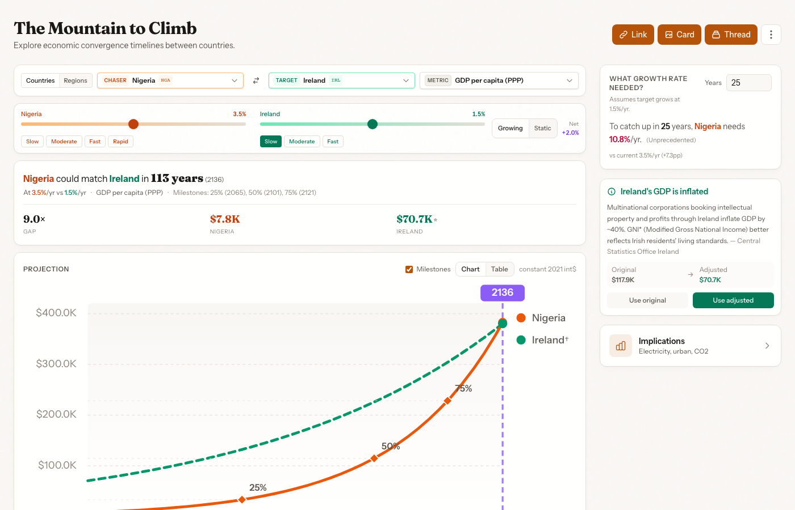

# Convergence Explorer

Interactive visualization tool for exploring economic and demographic convergence between regions. How long would it take Nigeria to match Ireland's GDP per capita?

**[Live Demo](https://convergence-explorer.pages.dev)**



Inspired by [The Mountain to Climb](https://oliverwkim.com/The-Mountain-To-Climb/) by Oliver Kim.

## Quick Start

```bash
cd app
pnpm install

# Initialize database and import World Bank data
pnpm db:init
pnpm data:fetch
pnpm db:import

# Start local server
pnpm start
```

Open http://localhost:8788

## Features

- **Country comparisons**: Compare any two countries across economic indicators
- **Regional analysis**: Explore convergence patterns within geographic regions
- **Growth projections**: Model different growth scenarios with adjustable rates
- **Implications panel**: See what GDP growth implies for electricity, urbanization, and emissions
- **Shareable**: Export charts, copy links, generate social cards

## Data

The database contains **217 countries** with data from 1990-2023:

- GDP per capita (PPP, constant 2021 international $)
- Total population
- Life expectancy at birth
- Internet users (% of population)
- Fertility rate
- Electricity generation by source (solar, wind, nuclear, coal)
- CO2 emissions

Sources: [World Bank Open Data](https://data.worldbank.org/), [Our World in Data](https://ourworldindata.org/)

## Tech Stack

- **Frontend**: React 19, TypeScript, Vite
- **Styling**: Tailwind CSS v4
- **Database**: Cloudflare D1 (SQLite)
- **Hosting**: Cloudflare Pages

## Development

```bash
pnpm dev          # Vite dev server (no database)
pnpm start        # Full stack with D1
pnpm build        # Production build
```

## Deployment

```bash
# Create D1 database
npx wrangler d1 create convergence-db

# Update wrangler.toml with database_id, then deploy
pnpm pages:deploy
```

## License

MIT
