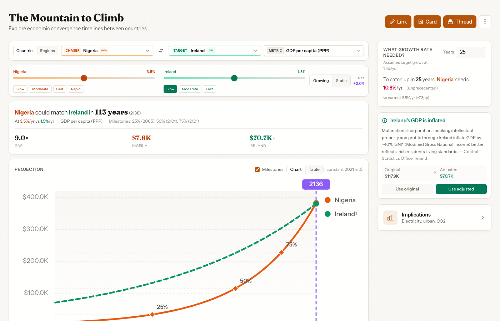

# Convergence Explorer

Interactive visualization tool for exploring economic and demographic convergence between regions. How long would it take Nigeria to match Ireland's GDP per capita?

**[Live Demo](https://convergence-explorer.pages.dev)**



Inspired by [The Mountain to Climb](https://oliverwkim.com/The-Mountain-To-Climb/) by Oliver Kim.

## Quick Start

```bash
cd app
pnpm install

# Initialize database and import World Bank data
pnpm db:init
pnpm data:fetch
pnpm db:import

# Start local server
pnpm start
```

Open http://localhost:8788

## Features

- **Country comparisons**: Compare any two countries across economic indicators
- **Regional analysis**: Explore convergence patterns within geographic regions
- **Growth projections**: Model different growth scenarios with adjustable rates
- **Implications panel**: See what GDP growth implies for electricity, urbanization, and emissions
- **Shareable**: Export charts, copy links, generate social cards

## Data

The database covers **217 countries** from 1990 to the latest published year (2025 for most economic series):

| Data | Source | Latest year |
| --- | --- | --- |
| GDP per capita (PPP, constant 2021 international $) | [World Bank](https://data.worldbank.org/indicator/NY.GDP.PCAP.PP.KD) | 2025 |
| Population, urbanisation, GDP (current US$), sector shares of GDP, investment | [World Bank](https://data.worldbank.org/) | 2025 |
| Life expectancy, fertility, internet use, electricity access, energy use, literacy | [World Bank](https://data.worldbank.org/) | 2024 |
| Population projections (low / medium / high) | [UN World Population Prospects 2024](https://population.un.org/wpp/) | projections to 2100 |
| Electricity generation by source (coal, nuclear, solar, wind, total) | [Our World in Data](https://github.com/owid/energy-data), [Ember](https://ember-energy.org/) | 2025 (partial) |
| CO2 emissions per capita | [Our World in Data](https://github.com/owid/co2-data) | 2024 |
| Installed solar and wind capacity | [IRENA](https://pxweb.irena.org/pxweb/en/IRENASTAT/) | 2025 |
| Regional GDP per capita | [OECD](https://www.oecd.org/) | varies by region |

### Refreshing the data

```bash
cd app
pnpm data:fetch   # writes data-import-fixed.sql
pnpm db:import    # loads it into the local D1 database
```

The fetch scripts default to last year as the end year. Ember generation needs `EMBER_API_KEY` in `app/.env`; without it that step is skipped. To import into production, back up first with `wrangler d1 export convergence-db --remote --output=backup.sql`, then run `wrangler d1 execute convergence-db --remote --file=./data-import-fixed.sql`.

## Tech Stack

- **Frontend**: React 19, TypeScript, Vite
- **Styling**: Tailwind CSS v4
- **Database**: Cloudflare D1 (SQLite)
- **Hosting**: Cloudflare Pages

## Development

```bash
pnpm dev          # Vite dev server (no database)
pnpm start        # Full stack with D1
pnpm build        # Production build
```

## Deployment

```bash
# Create D1 database
npx wrangler d1 create convergence-db

# Update wrangler.toml with database_id, then deploy
pnpm pages:deploy
```

## License

MIT
